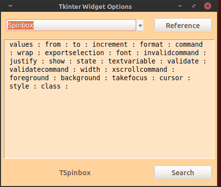

# tkinter-widget-reference
GUI quick ref for tkinter widget option key=value pairs

## tkinter Widget Options Reference


Drop-down combobox list of widgets:  
```text
Button
Checkbutton
Colors
Combobox
Entry
Frame
Label
LabelFrame
Layout Managers
Listbox
Message
Notebook
OptionMenu
PanedWindow
Progressbar
Radiobutton
Separator
Scale
Scrollbar
Spinbox
Text
Toplevel
Treeview
```

By selecting a widget you'll see this:  



Selecting "colors" opens a graphic for reference.

Selecting "Layout Managers" opens a pdf for reference.

Concerning specific widget help:

**Reference** button

With a widget selected clicking the **Reference** button  
opens your default web browser to the www.nmt.edu github  
tkinter doc page for the selected widget. This is one  
the most comprehensive tkinter reference sites.

**Bottom Panel**

In the bottom panel find the ttkthemes class name  
for the selected widget and the **Search** button.  
The **Search** button starts an Internet search  
for the "tkinter widget-name". If you highlight  
one of the displayed options it will search  
specifically for that widget option.  

_Esc_ and _Ctrl-q_ keys will exit the app.

Ctrl-k brings up a standard color chooser.

END
